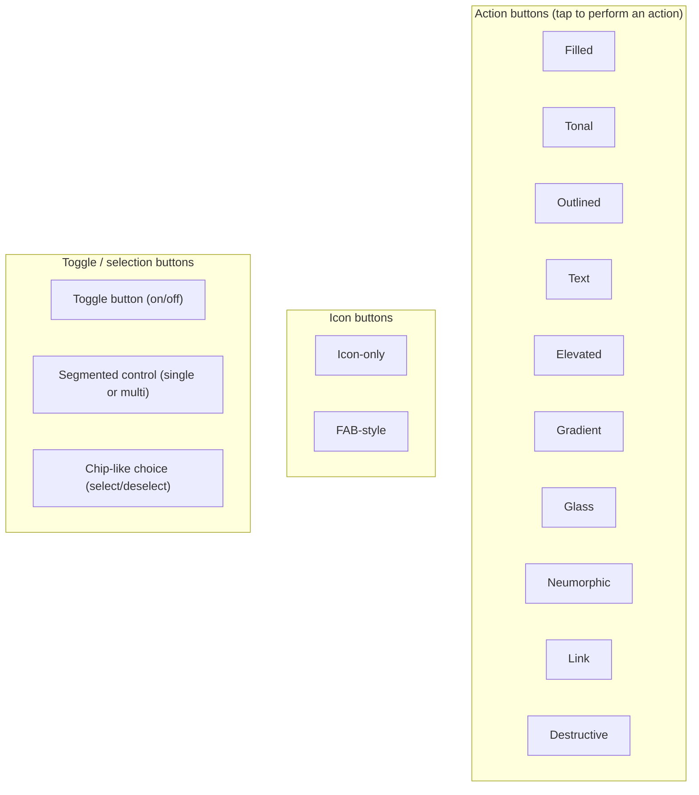
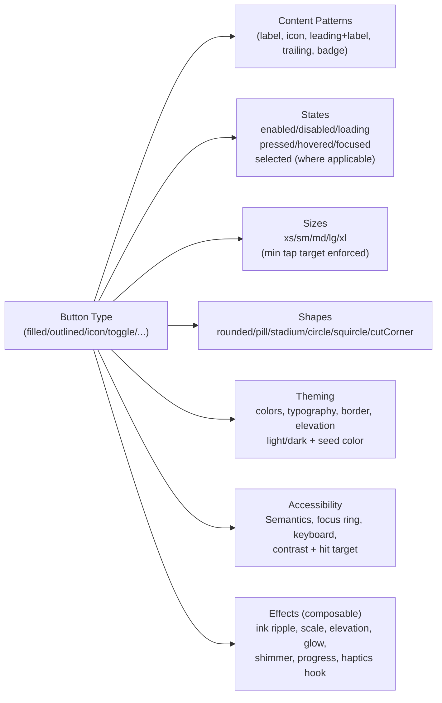

## Phase 1 — Setup, Requirements, and Project Blueprint

This document defines the **target package scope**, the **button/effect taxonomy**, and the **repository setup** needed before implementation.

### Diagram — Button types (catalog)




### Diagram — What every button type MUST support (capabilities contract)




### 1.1 What we are building

We are building a Flutter package that provides:

- A single primary widget: `**SuperButton**`
- A typed style model: `**SuperButtonStyle**`
- A composable effects system: `**SuperButtonEffect**` list
- A dedicated **showcase app** (in `example/`) that demonstrates *all* variants, sizes, shapes, states, and effects.

### 1.2 Constraints and principles

- **Consistency**: all variants share the same layout rules (padding, min size, icon gap, typography).
- **Composable effects**: effects are opt-in and stackable (scale + ripple + glow + shimmer, etc.).
- **State-complete**: every style must define behavior for disabled/loading/pressed/hovered/focused/selected.
- **Cross-platform**: mobile + web + desktop, with pointer hover/focus support.
- **Accessible**: semantics label, focus ring, keyboard activation, minimum tap target.

### 1.2.1 Phase 1 checklists (analysis)

These checklists are used to verify the planned scope before implementation starts.

#### Global checklist (applies to all button types)

- **Layout**: consistent padding, icon gap, baseline alignment, min tap target
- **States**: enabled, disabled, loading, pressed, hovered, focused
- **Animations**: duration and curves are consistent across variants
- **A11y**: semantics label, focus ring, keyboard activation (Enter/Space)
- **Theming**: light/dark, seed color, tone mapping (primary/neutral/success/warning/danger)
- **Effects**: effects are optional and composable (order-defined)
- **Example**: showcased in `example/` with code snippet generation

#### Button-type checklists (each one must be explicitly planned)

##### Filled

- Enabled/disabled/loading visuals
- Pressed/hovered/focused feedback
- Supports label + icons + badge
- Works with ripple + scale + elevation effects

##### Tonal

- Surface-based background + correct contrast
- Disabled/loading behaviors defined
- Hover/focus ring visible on desktop/web

##### Outlined

- Border color/width rules per tone + per state
- Pressed state does not “jitter” layout (border width stable)
- Loading keeps border stable (spinner inside)

##### Text

- Minimal chrome (no background by default)
- Hover/focus/pressed still discoverable
- Optional underline/link-like behavior toggle (if needed)

##### Elevated

- Elevation tokens per state (rest/hover/pressed/disabled)
- Shadow respects theme brightness

##### Gradient

- Gradient definition API (start/end/colors)
- Hover/press gradient shift (optional effect)
- Text/icon contrast always readable

##### Glass

- Blur/frosted strategy (and web fallback)
- Border + highlight + shadow rules
- Performance considerations documented

##### Neumorphic

- Light source direction tokens
- Pressed state switches inner/outer shadows
- Works in both light and dark themes (document constraints)

##### Link

- Looks like a link (underline optional)
- Keyboard focus ring visible
- Hover styles for web/desktop

##### Destructive

- Danger tone mapping across variants (filled/outlined/text destructive)
- Confirm/long-press policy documented (optional; example-only)

##### Icon-only

- Enforces minimum tap target
- Tooltip support in example app
- Supports selected state (optional)

##### FAB-style

- Shape + elevation rules
- Extended FAB variant (icon + label) considered

##### Toggle button (on/off)

- Selected state visuals + semantics (`toggled`)
- Works with keyboard and focus traversal
- Disabled + loading states defined

##### Segmented control

- Single-select and multi-select modes
- Focus movement with arrow keys (example)
- Dividers/borders don’t jitter on state change

##### Chip-like choice

- Selected/unselected visuals + remove icon (optional)
- Wrap layout support (example grid/wrap)

### 1.3 Button taxonomy (what “all button types” means)

Instead of implementing unrelated buttons, standardize into:

- **Variant** (visual intent)
- **Size** (spacing and font scale)
- **Shape** (corner radius / outline)
- **Tone/intent** (primary/secondary/success/warning/danger)
- **Content pattern** (label/icon/badge)
- **Effect stack** (interaction + loading + motion)

Recommended baseline variants:

- `filled`
- `tonal`
- `outlined`
- `text`
- `elevated`
- `gradient`
- `glass`
- `neumorphic`
- `icon`
- `fab`
- `link`
- `destructive`

Recommended sizes:

- `xs`, `sm`, `md`, `lg`, `xl`

Recommended shapes:

- `rounded`, `pill`, `stadium`, `circle`, `squircle`, `cutCorner`

### 1.4 Effects taxonomy (composable)

Define effects as small, reusable building blocks:

#### Interaction effects

- Ripple / ink splash (Material)
- Scale on press
- Elevation on hover/press
- Glow outline on focus
- Gradient shift on hover/press

#### Loading effects

- Inline spinner
- Shimmer overlay
- Progress indicator (linear) inside the button

#### Feedback hooks (optional)

- Haptics on tap (mobile)
- Optional sound callback hook

#### Motion

- Spring animations (press / release)
- Subtle bounce

### 1.5 Repository structure (target)

To publish on pub.dev you should have a Flutter **package** with an **example** app:

- `lib/`
  - `super_button_package.dart` (public exports)
  - `src/` (implementation)
- `example/` (showcase app)
- `test/`
- `README.md` (short, points to `doc/`)
- `doc/` (this set)
- `LICENSE`, `CHANGELOG.md`

### 1.5.1 Creating the package scaffold (`flutter create --template=package`)

Because this repository currently looks like a **Flutter app scaffold** (platform folders + `lib/main.dart`), there are two safe ways to move to a publishable **package** structure.

#### Option A (recommended): create the package in a new folder, then migrate

This avoids file conflicts.

```bash
mkdir super_button_package
cd super_button_package
flutter create --template=package .
flutter create example
```

Then move/port code:

- Package code → `super_button_package/lib/` (and `lib/src/`)
- Showcase app → `super_button_package/example/` (the generated `example/` app becomes the gallery)

#### Creating the `example/` showcase app (required)

The `example/` app is part of the expected Flutter package ecosystem, especially for UI libraries.

From the package root:

```bash
flutter create example
```

Then run it:

```bash
cd example
flutter run
```

Recommended example structure:

- `example/lib/main.dart` (routes + theme toggles)
- `example/lib/screens/gallery_screen.dart`
- `example/lib/screens/effects_playground_screen.dart`
- `example/lib/screens/accessibility_screen.dart`
- `example/lib/components/variant_grid.dart`

#### Option B: convert the current folder in-place

This writes the package template into the **current directory**.

```bash
flutter create --template=package .
```

Important notes:

- You should **back up or commit** before running this, because it can overwrite or regenerate files.
- A publishable package does **not** need `android/`, `ios/`, `web/`, `windows/`, `macos/`, `linux/` at the root.
  - Those platform folders belong in the `**example/` app** (or are generated by `flutter create example`).
- After conversion, ensure the package has:
  - `lib/super_button_package.dart`
  - `lib/src/...`
  - `example/` app

### 1.6 Package metadata checklist (for later, but plan now)

In `pubspec.yaml` (package root):

- `name`
- `description`
- `version` (SemVer)
- `repository`, `homepage`, `issue_tracker`
- `topics`
- remove `publish_to: 'none'` before publishing

### 1.7 Implementation blueprint (high-level)

Public API (draft):

```dart
SuperButton(
  onPressed: () {},
  label: const Text('Continue'),
  leading: const Icon(Icons.lock),
  style: const SuperButtonStyle(
    variant: SuperButtonVariant.filled,
    size: SuperButtonSize.md,
    shape: SuperButtonShape.pill,
  ),
  effects: const [
    SuperInkRippleEffect(),
    SuperScaleEffect(),
  ],
  loading: false,
  enabled: true,
)
```

Key decisions to finalize before Phase 2:

- **Style resolution**: how defaults are derived from `ThemeData` + overrides.
- **Effect lifecycle**: how effects read interaction state (pressed/hovered/focused).
- **Material integration**: when to use `InkWell` vs custom painter.

### 1.8 Definition of Done (Phase 1)

Phase 1 is done when:

- The variant/size/shape/effect taxonomy is finalized.
- The repo structure plan is agreed (package + `example/` app).
- Publishing metadata requirements are understood (license, changelog, pubspec fields).

