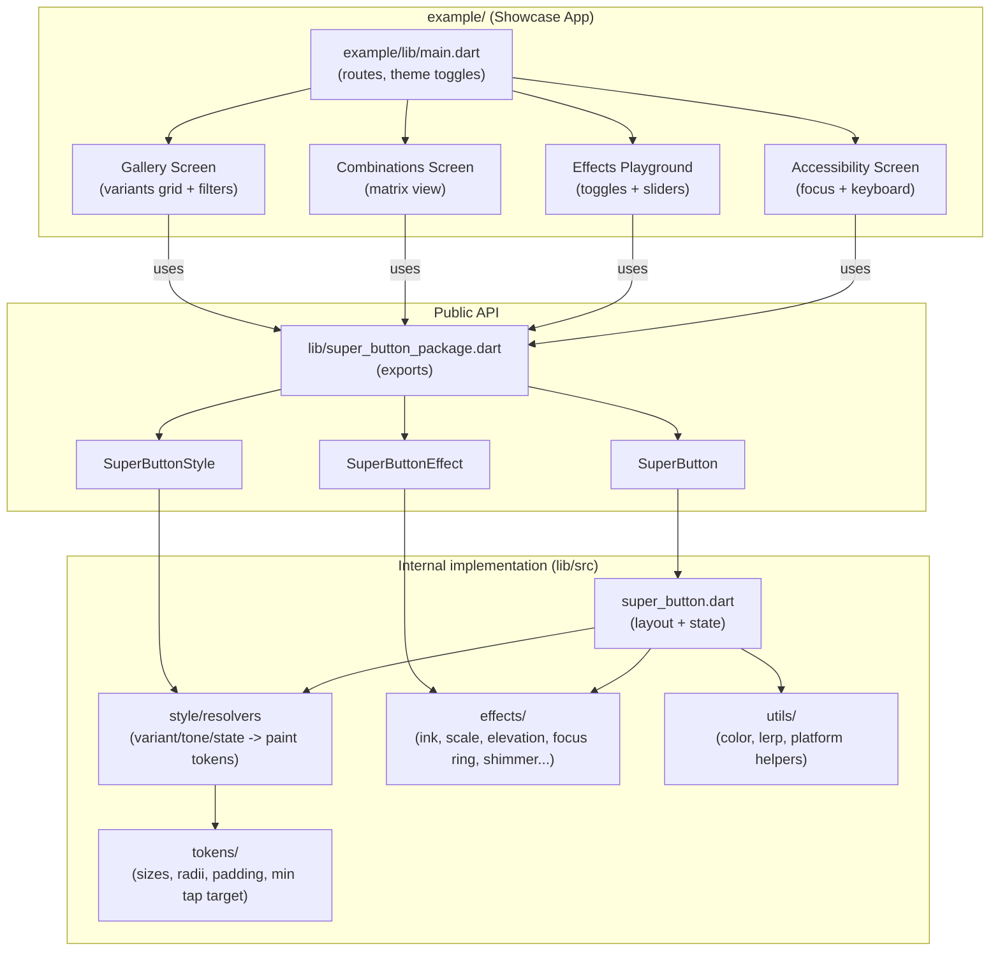
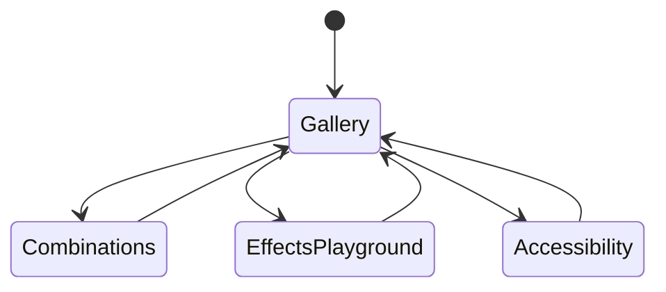

## Phase 2 — Package Implementation and Examples (Showcase App)

This document describes how to implement the package API, structure the code, and build the `example/` app that demonstrates **all** button types and effects.

### Diagram — Package architecture (recommended)

### Diagram — Showcase app navigation

### 2.1 Convert the repo to a publishable package layout

Target structure:

- `lib/`
  - `super_button_package.dart`
  - `src/`
    - `super_button.dart`
    - `style/` (style model + resolvers)
    - `effects/` (effect interface + built-in effects)
    - `tokens/` (sizes, radii, padding, min tap target)
    - `utils/` (helpers)
- `example/`
  - `lib/main.dart` (gallery app)
  - `lib/screens/`
  - `lib/components/`

Notes:

- Keep `lib/super_button_package.dart` as the **only** public entrypoint (export curated APIs).
- Keep implementation in `lib/src/` to avoid exposing internal details.

### 2.2 Public API design (recommended)

#### Core widget

- `SuperButton`
  - `VoidCallback? onPressed`
  - `Widget label` (required for non-icon variants)
  - `Widget? leading`
  - `Widget? trailing`
  - `bool loading`
  - `bool enabled` (optional; usually derived from `onPressed != null`)
  - `SuperButtonStyle style`
  - `List<SuperButtonEffect> effects`

#### Style model

- `SuperButtonStyle`
  - `SuperButtonVariant variant`
  - `SuperButtonSize size`
  - `SuperButtonShape shape`
  - `SuperButtonTone tone` (primary/neutral/success/warning/danger)
  - `EdgeInsets? paddingOverride`
  - `TextStyle? textStyleOverride`
  - `Color? backgroundColorOverride`
  - `Color? foregroundColorOverride`
  - `BorderSide? borderOverride`

#### Effects

- `SuperButtonEffect` (interface)
  - Should be composable and stateless where possible
  - Reads an interaction state model (pressed/hovered/focused/disabled/loading)

### 2.3 Interaction state model

Define a single internal state object (example shape):

- `pressed: bool`
- `hovered: bool`
- `focused: bool`
- `enabled: bool`
- `loading: bool`
- `selected: bool`

This state is the input for:

- style resolution (colors, shadows, border)
- effects (scale, glow, ripple, shimmer)

### 2.4 Built-in button variants (what to implement)

Minimum set for v1:

- `filled`, `tonal`, `outlined`, `text`, `elevated`
- `icon`
- `destructive` (can be `filled` + danger tone)

Optional “modern” variants (ship when stable):

- `gradient`
- `glass`
- `neumorphic`
- `link`
- `fab`

### 2.5 Built-in effects (what to implement)

Minimum set for v1:

- `SuperInkRippleEffect` (Material `InkWell`-based)
- `SuperScaleEffect` (press scale)
- `SuperElevationEffect` (hover/press elevation)
- `SuperFocusRingEffect` (focus outline)
- `SuperLoadingSpinnerEffect` (inline spinner + disabled interaction)

Optional:

- shimmer overlay (`SuperShimmerEffect`)
- gradient shift (`SuperGradientShiftEffect`)
- haptics (`SuperHapticsEffect`)

### 2.6 The `example/` showcase app (must-have)

The `example/` app should be the “living documentation”:

#### Screens

- **Gallery**
  - grid/list of buttons
  - filter panel:
    - variant
    - tone
    - size
    - shape
    - state (enabled/disabled/loading/selected)
    - effects toggles
  - code snippet panel (copy button)

- **Combinations**
  - automated matrix: rows = variants, columns = sizes or tones

- **Effects Playground**
  - interactive toggles for each effect
  - sliders for effect parameters (scale factor, duration, glow intensity)

- **Accessibility**
  - focus traversal
  - keyboard activation (Enter/Space)
  - semantics labels

#### UX recommendations

- Use `NavigationRail` (desktop/web) + `BottomNavigationBar` (mobile) with responsive layout.
- Provide dark/light toggle and seed color control.
- Keep scrolling smooth (use slivers for large lists).

### 2.7 Testing strategy

Minimum tests:

- `SuperButton` renders label and icons correctly.
- Disabled state blocks taps.
- Loading state shows spinner and blocks taps.
- Style resolver produces expected colors for each variant/tone/state.

### 2.8 Definition of Done (Phase 2)

Phase 2 is done when:

- The package exposes a stable API entrypoint in `lib/super_button_package.dart`.
- At least the minimum variant/effect set is implemented.
- The `example/` app demonstrates all variants, sizes, shapes, states, and effects.
- Analyzer and tests pass locally.

