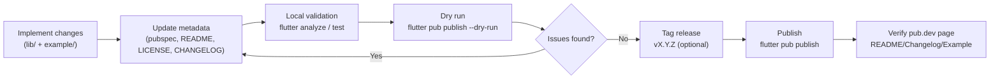

## Phase 3 — Publishing to pub.dev (Release Process)

This document is the step-by-step process to ship the package to pub.dev reliably.

### Diagram — Release / publish pipeline



### 3.1 Pre-publish repository checklist

- `lib/` contains the package code (no app-only entrypoint as the primary artifact)
- `example/` exists and runs
- `README.md` exists (short is fine; it should at least explain what it is and how to use it)
- `CHANGELOG.md` exists and is updated
- `LICENSE` exists (MIT/BSD/Apache-2.0 are common)
- Tests exist (`test/`) and pass
- Analyzer passes with no warnings

### 3.2 `pubspec.yaml` publishing requirements

Before publishing:

- Remove `publish_to: 'none'`
- Add package metadata:
  - `description` (clear and specific)
  - `version` (SemVer)
  - `repository` (Git URL)
  - `homepage` (optional but recommended)
  - `issue_tracker` (recommended)
  - `topics` (recommended)

Recommended `pubspec.yaml` snippet (align `version` with this release; example shows **0.2.1**):

```yaml
name: super_button_package
description: A complete Flutter button kit with composable effects and a showcase example app.
version: 0.2.1
repository: https://github.com/NurhayatYurtaslan/super_button_package
homepage: https://github.com/NurhayatYurtaslan/super_button_package
issue_tracker: https://github.com/NurhayatYurtaslan/super_button_package/issues
topics:
  - ui
  - widgets
  - button
  - design-system

environment:
  sdk: ">=3.4.0 <4.0.0"

dependencies:
  flutter:
    sdk: flutter

dev_dependencies:
  flutter_test:
    sdk: flutter
  flutter_lints: ^6.0.0
```

### 3.3 Versioning rules (SemVer)

- **Patch** (`x.y.Z`): bug fixes, no API changes
- **Minor** (`x.Y.z`): backward compatible features
- **Major** (`X.y.z`): breaking changes

Recommended early-stage path:

- **This repository** tags releases such as `v0.2.1` to match `pubspec.yaml` `version`.
- New packages often start at `0.1.0`, then increment patch/minor per SemVer and the repo [CHANGELOG](../CHANGELOG.md).
- Release `1.0.0` when you commit to API stability

### 3.4 Validate locally

Run:

```bash
flutter pub get
flutter analyze
flutter test
```

Dry-run the publish (this catches missing files and packaging problems):

```bash
flutter pub publish --dry-run
```

If the dry-run output mentions missing:

- `LICENSE`
- `CHANGELOG.md`
- `README.md`
- invalid `version`
- invalid links

…fix those before continuing.

### 3.4.1 Control what gets published (optional but useful)

If the publish archive is too large or includes irrelevant files, add a `.pubignore`.

Common examples to ignore:

- IDE folders (`.idea/`)
- build outputs
- platform folders at the package root (these should live under `example/`)

### 3.5 Improve pub.dev package quality (pana)

Install pana:

```bash
dart pub global activate pana
```

Run:

```bash
pana
```

Address common findings:

- analyzer warnings / lints
- missing or weak “Usage” section in README
- broken links
- excessive public API surface
- missing platform support notes

### 3.6 Release steps

1. Update `pubspec.yaml` version
2. Update `CHANGELOG.md`
3. Run tests + analyze + dry-run publish
4. Tag release in git (recommended): `vX.Y.Z`
5. Publish:

```bash
flutter pub publish
```

Authenticate when prompted (browser flow).

### 3.6.2 Publishing commands (copy/paste flow)

From the package root:

```bash
flutter pub get
flutter analyze
flutter test
flutter pub publish --dry-run
flutter pub publish
```

Optional (recommended) git tagging:

```bash
git tag v0.2.1
git push --tags
```

### 3.6.1 Minimum required files (copy/paste checklist)

- `README.md` (must include at least a short usage example)
- `CHANGELOG.md`
- `LICENSE`
- `pubspec.yaml` with correct metadata and version
- `lib/` with your public library entrypoint
- `example/` (strongly recommended for UI packages; expected by users)

### 3.7 Post-publish checklist

- Verify the package page renders README/Changelog correctly
- Check the “Example” section is present and useful
- Add screenshots/GIFs to the repository and reference them from README
- Open a few issues/labels (bug/enhancement/help wanted) to organize future work

### 3.8 Common pitfalls

- **Trying to publish an app scaffold** instead of a package
- **Leaving `publish_to: 'none'`** in `pubspec.yaml`
- **Forgetting LICENSE/CHANGELOG**
- **Publishing huge archives** (add `.pubignore` if needed)
- **Breaking API without bumping major/minor version**

